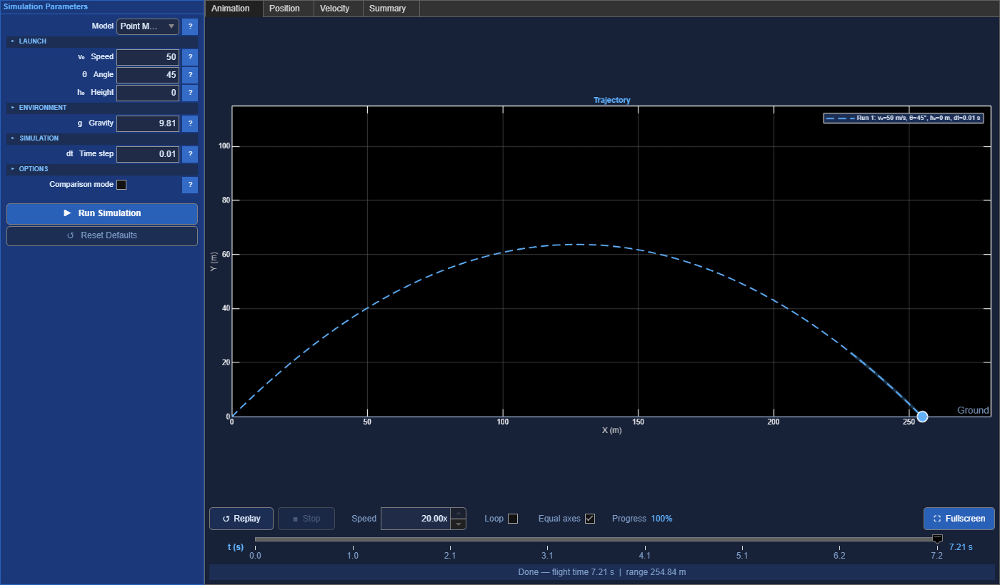
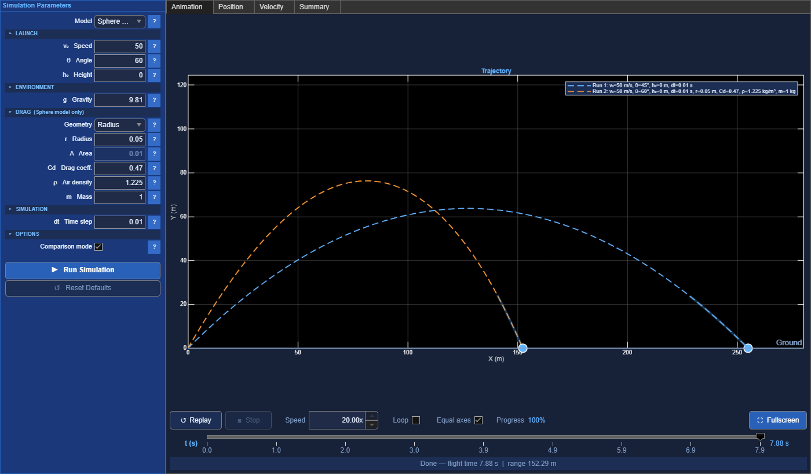
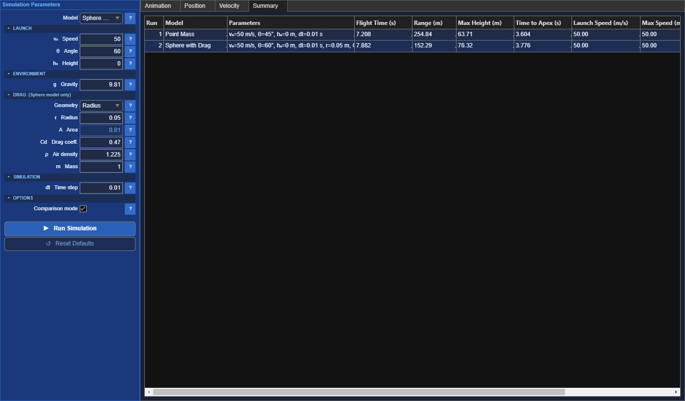

# Projectile Motion Simulator

An interactive MATLAB simulator for ideal point-mass trajectories and spheres
with quadratic aerodynamic drag. It includes exact ground-impact handling,
adaptive stiff/nonstiff integration, animated playback, run comparison, and a
numeric flight summary.

## Run the app

Open MATLAB in this directory and run:

```matlab
projectile_simulator
```

The implementation has been validated with MATLAB R2025b. The app uses only
base MATLAB functions (`uifigure`, `timer`, `ode45`, and `ode15s`).

## Screenshots

### Point-mass trajectory

The default 50 m/s, 45° launch completes at 7.21 seconds and 254.84 metres.



### Comparison mode

Comparison mode overlays runs while preserving a shared physical scale. This
example compares the default point mass with a 50 m/s sphere launched at 60°.



### Results summary

Each comparison run retains its inputs and derived flight measurements.



## Sample outputs

Both examples use `g = 9.81 m/s²`, `h0 = 0 m`, and `dt = 0.01 s`. The drag
case uses a 0.05 m radius, `Cd = 0.47`, air density `1.225 kg/m³`, and mass
`1 kg`.

| Model | Speed | Angle | Flight time | Range | Maximum height | Impact speed | Impact angle |
|---|---:|---:|---:|---:|---:|---:|---:|
| Point mass | 50 m/s | 45° | 7.208 s | 254.84 m | 63.71 m | 50.00 m/s | −45.00° |
| Sphere with drag | 50 m/s | 60° | 7.882 s | 152.29 m | 76.32 m | 38.17 m/s | −66.84° |

Regenerate all three screenshots from the running app with:

```matlab
examples
```

## Models

The point-mass model is evaluated analytically:

```text
x(t) = v0 cos(theta) t
y(t) = h0 + v0 sin(theta) t - g t^2 / 2
```

The drag model solves:

```text
dv/dt = gravity - (rho Cd A / 2m) |v| v
```

It uses adaptive integration, switches to a stiff solver when necessary, and
terminates on the downward `y = 0` event. `dt` is the maximum solver step for
drag and the output sampling interval for the analytic model.

Model assumptions:

- flat, stationary ground
- uniform constant gravity
- constant fluid density and drag coefficient
- still fluid, with no wind
- no lift, spin, buoyancy, or Coriolis effects
- constant mass and frontal area

The impact angle is signed relative to the positive horizontal direction;
downward impacts are negative.

## Safety behavior

Inputs must be finite real scalars. The solver enforces time and step limits
and reports a visible UI error instead of returning non-finite trajectories.
The optional programmatic fields `maxTime` and `maxSteps` override the default
limits of 3600 seconds and 250,000 stored steps.
Drag integration continues until impact or the configured `maxTime`. The
`maxSteps` budget counts actual output samples, including launch and impact;
an output callback stops integration when that budget is reached. Output
refinement is disabled so every accepted step adds one sample. This bounds
trajectory output, not the solver's constant-size working storage.

## Tests

Run the regression suite with:

```matlab
results = runtests("tests");
assertSuccess(results);
```

The suite checks closed-form point-mass results, exact ground events, elevated
launches, zero-drag convergence, drag invariants, signed impact angles, input
validation, and resource limits.

GitHub Actions runs the same tests and MATLAB Code Analyzer checks on every
push and pull request to `main`.

## License

Released under the [MIT License](LICENSE).
